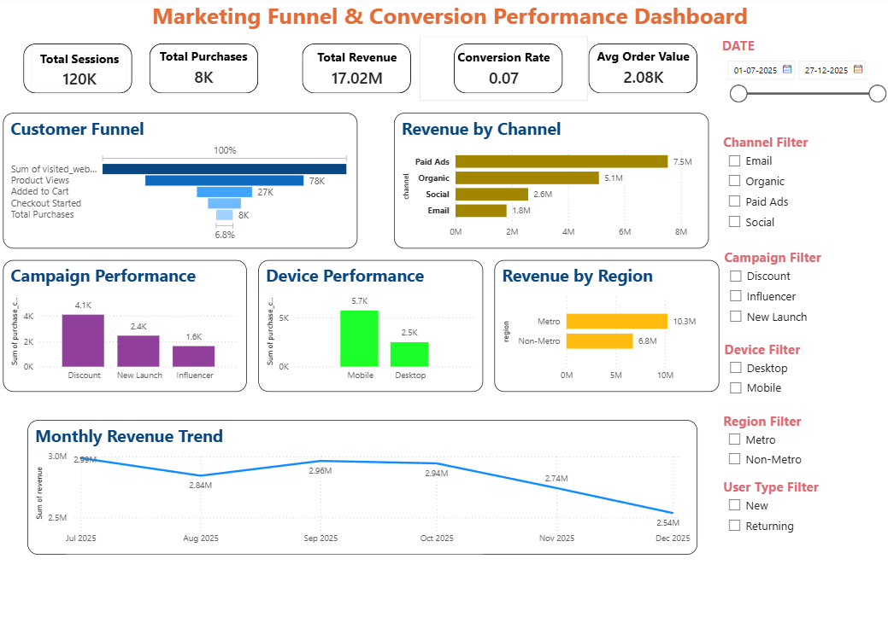
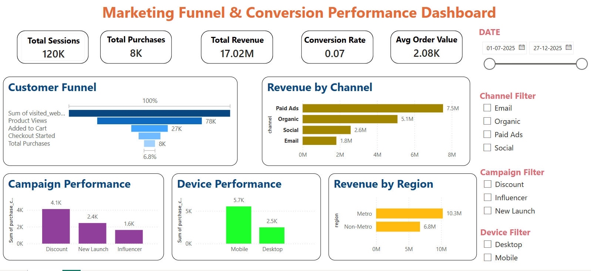

# Marketing Funnel & Conversion Performance Dashboard

## Project Overview
An interactive Power BI dashboard built to analyze marketing funnel performance, customer behavior, and revenue trends.

This project combines Python-based data cleaning, exploratory analysis, and Power BI dashboard development.

---

## Dashboard Preview



---

## Key Features
- Dynamic KPI Cards
- Customer Funnel Analysis
- Revenue by Marketing Channel
- Campaign Performance Tracking
- Device-wise Purchase Analysis
- Regional Revenue Comparison
- Monthly Revenue Trend Analysis
- Interactive Filter Slicers

---

## Tech Stack
- Python
- Pandas
- Jupyter Notebook
- Power BI
- DAX

---

## Project Structure

```bash
dashboard/
    task3.pbix

data/
    raw/
        d2c_marketing_funnel_dataset.csv

    processed/
        cleaned_marketing_funnel_data.csv

images/
    CustomerFunnel.png
    Fulldashboard.png
    Revenue Trend.png

notebooks/
    channel_comparison.ipynb
    data_cleaning.ipynb
    data_loading.ipynb
    exploratory_analysis.ipynb
    final_insights.ipynb
    funnel_analysis.ipynb

src/

main.py
README.md
requirements.txt
```

---

## Business Insights

### Customer Funnel
A noticeable drop-off occurs between product views and cart additions, indicating possible friction in the purchase journey.

### Revenue by Channel
Paid Ads generated the highest revenue, making it the top-performing acquisition channel.

### Device Performance
Mobile users contributed the highest number of purchases, showing strong mobile customer engagement.

### Regional Analysis
Metro customers generated more revenue compared to Non-Metro customers.

### Monthly Revenue Trend
Revenue fluctuated over the months, with a decline toward the end of the observed period.

---

## Dashboard Screenshots

### Full Dashboard


### Customer Funnel


### Revenue Trend


---

## How to Run

1. Clone this repository

```bash
git clone <your-repo-link>
```

2. Install dependencies

```bash
pip install -r requirements.txt
```

3. Run preprocessing notebooks

4. Open Power BI dashboard

```bash
dashboard/task3.pbix
```

---

## Author
Shishir